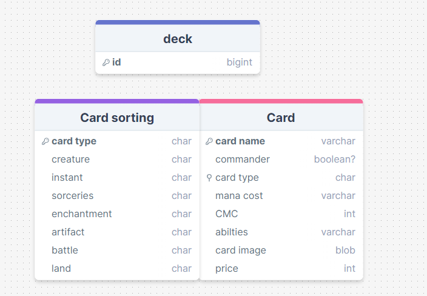

# Development of a Database-Linked Website for NCEA Level 2

Project Name: **PROJECT NAME HERE**

Project Author: **YOUR NAME HERE**

Assessment Standards: **91892** and **91893**

-------------------------------------------------

## Design, Development and Testing Log

### MAY 16th

today i started a draft for mky database

a basic draft for my database layout, not completed
### DATE HERE

Replace this test with what you are working on

Replace this text with brief notes describing what you worked on, any decisions you made, any changes to designs, etc. Add screenshots / links to other media to illustrate your notes where necessary.

### DATE HERE

Replace this test with what you are working on

Replace this text with brief notes describing what you worked on, any decisions you made, any changes to designs, etc. Add screenshots / links to other media to illustrate your notes where necessary.

### DATE HERE

Replace this test with what you are working on

Replace this text with brief notes describing what you worked on, any decisions you made, any changes to designs, etc. Add screenshots / links to other media to illustrate your notes where necessary.

### DATE HERE

Replace this test with what you are working on

Replace this text with brief notes describing what you worked on, any decisions you made, any changes to designs, etc. Add screenshots / links to other media to illustrate your notes where necessary.

### DATE HERE

Replace this test with what you are working on

Replace this text with brief notes describing what you worked on, any decisions you made, any changes to designs, etc. Add screenshots / links to other media to illustrate your notes where necessary.

-------------------------------------------------

## Final System Design

### Database Structure

Place a image here that shows the *final design* of your database: tables, fields and relationships.

### User Interface Design

Place images here that show your *final design* of your UI: layout, colours, etc.

-------------------------------------------------

## Completed System

### Database Structure

Place a image here that shows the *actual database structure* that you implemented: tables, fields and relationships.

### User Interface Design

Place screenshots and notes here that show your *actual system UI* in action.

-------------------------------------------------

## Review and Evaluation

### Meeting the Needs of the Users

Replace this text with a brief evaluation of how well you met the needs of your users. Look at what you initially wrote about who they are, what specific needs they have, etc. and discuss how well the system meets those needs.

### Meeting the System Requirements

Replace this text with a brief evaluation of how well you met the requirements that you defined at the start of the project, etc. Look back at the list of features / functionality you initially set and discuss how well your system has implemented each one.

### Review of IMPLICATION NAME HERE

Replace this text with brief notes showing how the implication was addressed in the final outcome. Accompany the notes with screenshots / other media to illustrate specific features.

### Review of IMPLICATION NAME HERE

Replace this text with brief notes showing how the implication was addressed in the final outcome. Accompany the notes with screenshots / other media to illustrate specific features.

### Review of IMPLICATION NAME HERE

Replace this text with brief notes showing how the implication was addressed in the final outcome. Accompany the notes with screenshots / other media to illustrate specific features.

